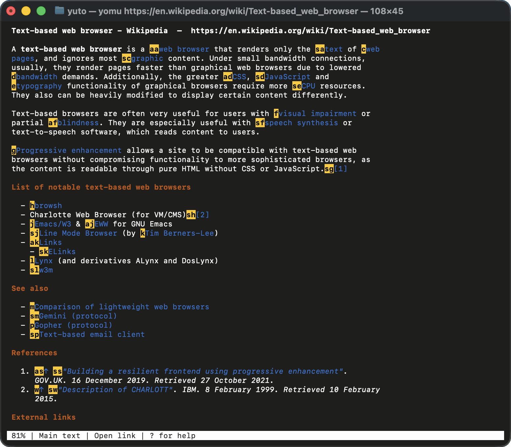
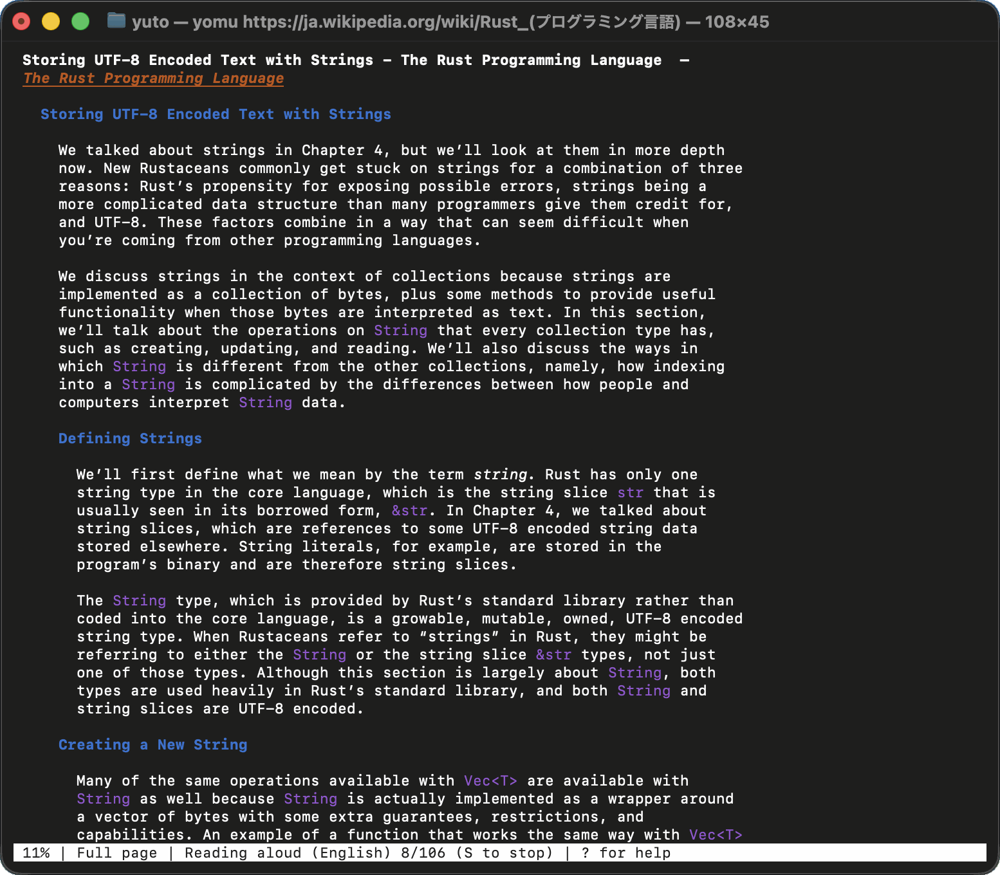
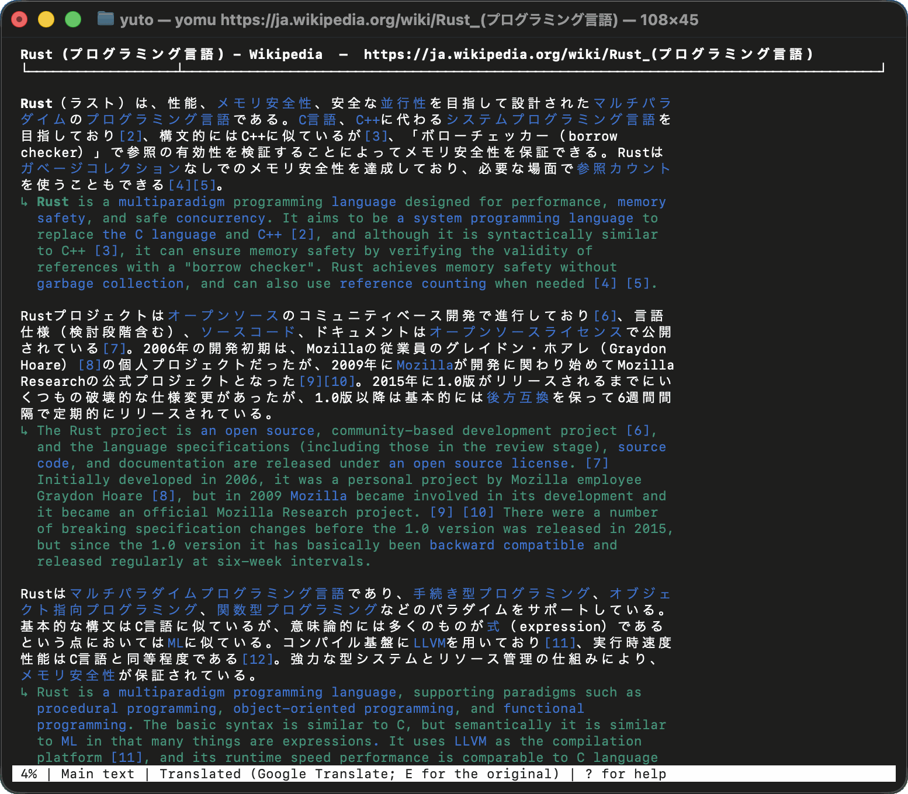

# yomu

[English](README.md) | 日本語 | [한국어](README.ko.md)

**yomu** は、読むことに特化した、Rust 製の軽量なターミナル用 Web ブラウザです。名前は **Y**uto's **O**reore **M**inimal **U**ser-interface browser の頭文字から取っています。
ページからナビゲーションや広告、フッターを取り除いて本文だけを抜き出し、見出しや箇条書き、表、コードの構造を保ったまま表示します。
Vimium と同じキーで操作でき、手元で動く音声合成で読み上げたり、原文を残したまま翻訳したりできます。



<sub>画像のページは、英語版 Wikipedia の「[Text-based web browser](https://en.wikipedia.org/wiki/Text-based_web_browser)」です([CC BY-SA 4.0](https://creativecommons.org/licenses/by-sa/4.0/))。</sub>

## 特徴

- ページの本文を抜き出し、ターミナルに読みやすく並べます。`a` でページ全体の表示に切り替えられます。PDF は文字を取り出して表示し、表示できないファイルは `~/Downloads` に保存します。
- キー操作は [Vimium](https://github.com/philc/vimium) と同じです。`j` `k` でスクロール、`f` でリンクを開く、`o` で URL を開く、`H` `L` で戻る・進む、といった操作がそのまま通じます。マウスでも操作できます。
- `S` を押すと、手元で動く高品質な音声合成モデル [Supertonic 3](https://huggingface.co/Supertone/supertonic-3) が、31 の言語でページを読み上げます。ページの文章を外部に送ることはありません。
- `E` を押すと、[Immersive Translate](https://immersivetranslate.com/) と同じように原文の段落のすぐ下に訳文を並べます。`e` では原文を訳文に置き換えます。翻訳には Google 翻訳を使うため、本文が Google に送られます。
- プライベートモード(実験的)では、すべての通信を Tor に通し、履歴やタブ、Cookie を残さずに閲覧できます。起動するときに `--private` を付けるか、設定画面(`gs`)で切り替えます。
- 画面は英語、日本語、韓国語で表示できます。言語はシステムの設定に合わせて決まり、設定画面で変えられます。

ページの JavaScript は実行しません。SNS や Web アプリのように JavaScript で本文を組み立てるページは読めないので、`gx` で普段のブラウザで開いてください。

## インストール

macOS で開発し、動作を確かめています。ビルド済みのバイナリは Apple Silicon の Mac 向けです。

### Homebrew

```sh
brew install bobinosuke/tap/yomu
```

入れたあとは、どのターミナルからでも `yomu` で起動できます。

### インストール用のスクリプト

```sh
curl --proto '=https' --tlsv1.2 -LsSf https://github.com/bobinosuke/yomu/releases/latest/download/yomu-installer.sh | sh
```

`yomu` を `~/.local/bin` に置き、必要なら `PATH` に足します。

### Cargo

Intel の Mac を使っている場合や、自分でビルドしたい場合は、Cargo で入れられます。Rust 1.92 以上が必要です([rustup](https://rustup.rs/) で入れるのが簡単です)。

```sh
cargo install --git https://github.com/bobinosuke/yomu yomu
```

Cargo は `yomu` を `~/.cargo/bin` に置きます。入れたあとに `yomu` が見つからない場合は、`~/.zshenv`(または使っているシェルの設定ファイル)に `. "$HOME/.cargo/env"` を足してください。

### ソースからビルドする

```sh
git clone https://github.com/bobinosuke/yomu
cd yomu
cargo build --release
./target/release/yomu
```

ビルドの途中で、読み上げに使う ONNX Runtime のビルド済みバイナリをダウンロードします。初回のビルドにはネットワーク接続が必要です。Linux でも動く可能性はありますが、まだ確かめていません。

## 使い方

```sh
yomu                       # 空のタブで始める (o で開く、? でヘルプ)
yomu https://example.com   # URL を開く
yomu 将棋 ルール            # URL 以外は DuckDuckGo で検索する
yomu --dump URL            # ページを Markdown で出力する (パイプ向け)
yomu --private             # プライベートモード (Tor)
```

起動したあと `?` を押すと、すべてのキー操作の一覧が出ます。よく使うキーは次のとおりです。

| キー | 操作 |
|---|---|
| `j` `k` / `h` `l` | 下・上 / 左・右にスクロール |
| `d` `u` / `gg` `G` | 半ページ下・上 / 先頭・末尾 |
| `f` / `F` | リンクにラベルを出して開く / 新しいタブで開く |
| `o` / `O` | URL を開く・検索する(履歴とブックマークから候補を出す)/ 新しいタブで |
| `H` `L` | 戻る / 進む |
| `[[` `]]` | 「前へ」「次へ」のリンクを開く |
| `/` `n` `N` | ページ内検索 / 次・前の一致 |
| `v` `V` | ビジュアルモード(文字単位・行単位で選択)。`y` でコピー |
| `t` `x` `X` | 新しいタブ / タブを閉じる / 閉じたタブを戻す |
| `J` `K` | 左 / 右のタブ |
| `yy` / `yf` | ページの URL / リンクの URL をコピー |
| `r` / `Esc` | 再読み込み / 取り消し |

yomu 独自のキーもあります。

| キー | 操作 |
|---|---|
| `s` | 検索 |
| `a` | 本文抽出とページ全体の表示を切り替える |
| `S` | 画面の位置から読み上げる / 止める |
| `e` / `E` | ページを翻訳する(置き換え / 対訳) |
| `gi` | ページの入力欄(検索欄など)に入力して送る |
| `gb` | ブックマークに追加する / 外す |
| `gh` | 履歴(1 時間以内・昨日と今日・すべての履歴を消せる) |
| `gs` | 設定 |
| `gp` | プライベートモードに切り替える / 戻る |
| `gx` | 普段のブラウザで開く |
| `q` | 終了 |

マウスでは、リンクのクリック(中ボタンか Ctrl+クリックで新しいタブ)、タブの切り替え、ホイールでのスクロール、ドラッグでの文字の選択ができます。

### 設定

`gs` で設定画面を開き、項目を `f` のラベルかクリックで選びます。

- **言語 (Language)**: 画面の言語(自動・日本語・English・한국어)。翻訳の訳し先と検索の地域も、この言語に合わせます。自動のときは `LC_ALL`、`LC_MESSAGES`、`LANG`、macOS の言語設定の順に見て決めます。
- **Cookie をファイルに残す**: Cookie の同意やログインを、次に起動したときも覚えておきます。
- **広告・追跡のリンクを消す**: リンクから `utm_*` などの追跡用の値を除き、広告や追跡サービスへのリンクを外します。
- **画像を表示する**: ターミナルの中に画像を描きます(Kitty、Ghostty、iTerm2、WezTerm など。それ以外のターミナルでは文字のブロックで粗く描きます)。
- **プライベートモード (Tor)**: オンにすると、yomu をプライベートモードで起動し直します。オフにすると普段のモードに戻ります(`gp` と同じです)。

履歴、ブックマーク、開いていたタブは `~/.local/share/yomu/` に保存し、次に起動したときにタブを開き直します。

### 読み上げ

初めて `S` を押したときは、必要なデータ(合わせて約 770MB)をダウンロードしてよいかを確かめます。ダウンロードするのは、Supertonic 3 のモデル、日本語の文に混じる英単語を読むための辞書、言語の判定に使うデータです。どれも `~/.cache/yomu` に保存します。
ページの言語は自動で判定します。日本語、英語、韓国語をはじめ、31 言語を読み上げられます。ビジュアルモードで文を選んで `S` を押すと、選んだところだけを読みます。



### 翻訳

`E` で原文の段落の下に訳文を並べ、`e` で原文を訳文に置き換えます。同じキーをもう一度押すと原文に戻ります。文を選んで `E` を押すと、選んだところだけを訳せます。訳し先は画面の言語です。初めて翻訳するときは、本文を Google に送ってよいかを `y` / `n` で確かめます(`y` を選ぶと、次からは聞きません)。



<sub>画像のページは、日本語版 Wikipedia の「[Rust (プログラミング言語)](https://ja.wikipedia.org/wiki/Rust_(%E3%83%97%E3%83%AD%E3%82%B0%E3%83%A9%E3%83%9F%E3%83%B3%E3%82%B0%E8%A8%80%E8%AA%9E))」です([CC BY-SA 4.0](https://creativecommons.org/licenses/by-sa/4.0/))。</sub>

### プライベートモード(実験的)

プライベートモードには、起動するときに `--private` を付けるか、使っている途中で設定画面(`gs`)の「プライベートモード」を選ぶか `gp` を押すと切り替わります。普段のモードと何も共有しないよう、切り替えるたびに yomu は起動し直します。

- すべての通信を、yomu に組み込んだ [Arti](https://gitlab.torproject.org/tpo/core/arti) で Tor に通します。名前の解決も Tor の出口で行い、`.onion` のサイトも開けます。
- サイトごとに別の Tor の回線を使います(Tor Browser の first-party isolation と同じ考え方です)。
- HTTPS のページだけを開きます(`.onion` は除きます)。
- User-Agent、TLS と HTTP/2 の指紋、ヘッダーを Tor Browser に合わせて名乗ります。
- 履歴、タブ、Cookie はディスクに書きません。翻訳と `gx` は Tor を通らないので使えません。

この機能は実験的なものです。IP アドレスは隠せますが、読み込み方の違いから yomu を使っていることは見分けられるため、Tor Browser ほどの匿名性はありません。強い匿名性が必要なときは Tor Browser を使ってください。

## 謝辞

次のプロジェクトやサービスから、多くの考え方を借りています。

- [Vimium](https://github.com/philc/vimium): キー操作
- [Immersive Translate](https://immersivetranslate.com/): 原文を残す対訳
- [Translate Web Pages (TWP)](https://github.com/FilipePS/Traduzir-paginas-web): リンクや書式を保ったままページを訳す方法
- [Tor Browser](https://www.torproject.org/): プライベートモードの振る舞い
- [curl_cffi](https://github.com/lexiforest/curl_cffi): 本物のブラウザと同じ接続の指紋で通信する考え方
- 検索には [DuckDuckGo](https://duckduckgo.com/)、翻訳には [Google 翻訳](https://translate.google.com/) を使っています

### 使っているオープンソースソフトウェア

| プロジェクト | 用途 |
|---|---|
| [Supertonic 3](https://huggingface.co/Supertone/supertonic-3) | 読み上げのモデル(初回にダウンロード) |
| [ONNX Runtime](https://onnxruntime.ai/)([ort](https://github.com/pykeio/ort) 経由) | 読み上げのモデルの実行 |
| [OpenJTalk](https://open-jtalk.sourceforge.net/) の辞書([pyopenjtalk-plus](https://github.com/tsukumijima/pyopenjtalk-plus) から) | 読み上げのための日本語の解析 |
| [AivisSpeech Engine](https://github.com/Aivis-Project/AivisSpeech-Engine) の辞書 | 日本語の読み上げでの単語の読み |
| [kanalizer](https://github.com/VOICEVOX/kanalizer) | 日本語の文の中の英単語の読み |
| [lingua-rs](https://github.com/pemistahl/lingua-rs) | ページの言語の判定 |
| [rs-trafilatura](https://github.com/Murrough-Foley/rs-trafilatura) | 本文の抽出 |
| [html5ever](https://github.com/servo/html5ever)、[dom_query](https://github.com/niklak/dom_query)、[scraper](https://github.com/rust-scraper/scraper) | HTML の解析 |
| [ratatui](https://github.com/ratatui/ratatui)、[ratatui-image](https://github.com/ratatui/ratatui-image)、[crossterm](https://github.com/crossterm-rs/crossterm) | ターミナルの画面と画像の表示 |
| [wreq](https://github.com/0x676e67/wreq)、[wreq-util](https://github.com/0x676e67/wreq-util) | ブラウザと同じ指紋での HTTP 通信 |
| [Arti](https://gitlab.torproject.org/tpo/core/arti) | プライベートモードの Tor |
| [tokio](https://github.com/tokio-rs/tokio) | 非同期処理 |
| [encoding_rs](https://github.com/hsivonen/encoding_rs)、[chardetng](https://github.com/hsivonen/chardetng) | 文字コード(Shift_JIS、EUC-JP など) |
| [pdf-extract](https://github.com/jrmuizel/pdf-extract) | PDF からの文字の取り出し |
| [image](https://github.com/image-rs/image) | 画像の読み込み |
| [cpal](https://github.com/rustaudio/cpal) | 音声の出力 |
| [mimalloc](https://github.com/purpleprotocol/mimalloc_rust) | メモリの管理 |

## ライセンス

yomu は、[MIT License](LICENSE-MIT) と [Apache License 2.0](LICENSE-APACHE) のどちらか好きな方を選んで使えます。

`vendor/lingua` は [lingua](https://github.com/pemistahl/lingua-rs) 1.8.0 を改変したもので、Apache License 2.0 のままです。読み上げのモデル、辞書、言語のデータは yomu に含まれておらず、初めて使うときにそれぞれの配布元からダウンロードします。これらはそれぞれのライセンスに従います(Supertonic 3 のモデルは OpenRAIL-M です)。
